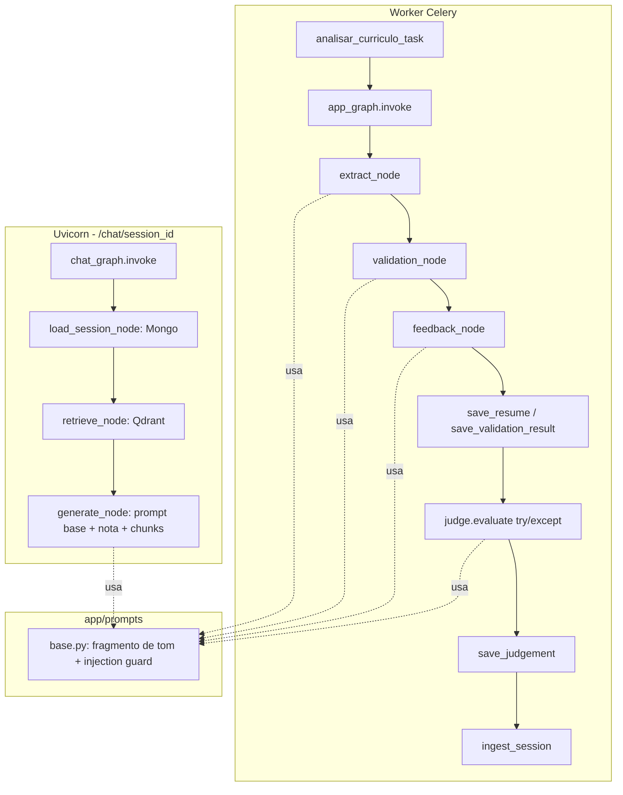

# Backend: limpeza, prompt base, evaluator e chat com contexto — Design

**Spec**: `.specs/features/backend-cleanup-evaluators/spec.md`
**Status**: Draft

---

## Architecture Overview

Três mudanças estruturais compõem esse lote: (1) o worker passa a chamar `app_graph.invoke(...)`
em vez de funções soltas; (2) todo prompt de LLM passa a compor a partir de `app/prompts/base.py`;
(3) `chat_graph` ganha um nó novo (`load_session_node`) que busca o `ValidationResult` no Mongo
antes de gerar a resposta, e `judge.py` roda como um passo a mais dentro da task Celery, com falha
isolada (nunca derruba o pipeline).



---

## Code Reuse Analysis

### Existing Components to Leverage

| Component | Location | How to Use |
|---|---|---|
| `client.chat.completions.parse(response_format=Schema)` | `app/agents/validator/agent.py`, `app/api/extraction/extract_data.py` | Mesmo padrão pro `judge.evaluate` — schema Pydantic novo, `response_format=JudgeResult`. |
| Padrão repositório `save_x`/`get_x` | `app/db/repositories/validation_repository.py` | Clonar pra `judge_repository.py` (nova coleção `judgements`). |
| `app.core.tracing.trace` | já usado em `app/rag`, `app/chats` | Adicionar chamadas nos nós novos/alterados (`load_session_node`, chamada ao judge). |
| `GraphState` (TypedDict) | `app/states/state.py` | Já tem todos os campos que `app_graph` precisa — só remover `need_more_infos`, resto se mantém. |

### Integration Points

| System | Integration Method |
|---|---|
| MongoDB | `judge_repository.py` novo, mesma conexão `app/db/mongo.py::db`; `chat_graph` passa a importar `validation_repository.get_validation_result`. |
| Qdrant | Sem mudança de integração — só a origem da URL/collection (settings em vez de hardcode). |
| Celery | Sem mudança de assinatura da task — `judge.evaluate` é uma chamada a mais dentro do `try` existente, isolada com seu próprio `try/except`. |

---

## Components

### `app/prompts/base.py`

- **Purpose**: Fragmentos de prompt compartilhados — tom/idioma, contrato de resposta, defesa de
  prompt injection — compostos por cada agente.
- **Location**: `app/prompts/base.py`
- **Interfaces**:
  - `INJECTION_GUARD: str` — constante com o texto de defesa (hoje só existe inline no validator).
  - `build_system_prompt(role_instructions: str, *, include_injection_guard: bool = True) -> str` —
    monta o system prompt final: instruções específicas do agente + fragmento base.
- **Dependencies**: nenhuma (módulo folha, só strings).
- **Reuses**: extrai literalmente o texto de defesa já existente em
  `app/agents/validator/agent.py` (não inventa texto novo, só centraliza).

### `app/schemas/judge_result.py`

- **Purpose**: Schema Pydantic da saída do judge.
- **Location**: `app/schemas/judge_result.py`
- **Interfaces**: `JudgeResult(is_consistent: bool, issues: list[str], confidence: float,
  comment: str, validation_id: str | None)` — segue o padrão de `ValidationResult` (campo `*_id`
  setado depois de persistir, igual ao `resume_id`/`job_id` em `ValidationResult`).
- **Dependencies**: pydantic.
- **Reuses**: mesmo padrão de `Field(ge=0, le=1)` usado em `RequirementScore.score`
  (`app/schemas/validation_result.py`) pra `confidence`.

### `app/judge/judge.py`

- **Purpose**: Chama LLM pra criticar a consistência do `ValidationResult`+feedback já gerados
  (LLM-as-judge).
- **Location**: `app/judge/judge.py`
- **Interfaces**: `evaluate(resume: CurriculoExtraido, job: JobRequirements, validation:
  ValidationResult, feedback: str) -> JudgeResult`
- **Dependencies**: OpenAI client (mesmo padrão de `app/agents`), `app/prompts/base`.
- **Reuses**: `app/agents/validator/agent.py` como referência direta de estrutura (mesma forma de
  montar `client.chat.completions.parse`).

### `app/db/repositories/judge_repository.py`

- **Purpose**: Persistência do `JudgeResult`.
- **Location**: `app/db/repositories/judge_repository.py`
- **Interfaces**: `save_judgement(result: JudgeResult) -> str`, `get_judgement(validation_id: str)
  -> JudgeResult | None` (busca por campo `validation_id`, não por `_id` — 1:1 com a validação).
- **Dependencies**: `app/db/mongo`, `app/schemas/judge_result`.
- **Reuses**: clone estrutural de `validation_repository.py`.

### `app/graph/graph.py` (modificado)

- **Purpose**: sem mudança de responsabilidade — passa a ser efetivamente invocado.
- **Location**: `app/graph/graph.py`
- **Interfaces**: sem mudança de assinatura (`app_graph.invoke({"resume_text":...,
  "job_requirements":...})` já é o contrato hoje, só não usado).
- **Dependencies**: sem mudança.
- **Reuses**: N/A — módulo já existe, só passa a ser chamado.

### `app/worker/tasks.py` (modificado)

- **Purpose**: orquestra o pipeline via `app_graph.invoke`, chama `judge.evaluate` com
  isolamento de falha, persiste tudo, dispara ingestão RAG.
- **Location**: `app/worker/tasks.py`
- **Interfaces**: assinatura de `analisar_curriculo_task` não muda (mesmos parâmetros, mesmo
  retorno pro Celery/`/cv/status`).
- **Dependencies**: `app_graph`, `judge.evaluate`, `judge_repository.save_judgement`.
- **Reuses**: mantém o `try/finally` existente pro cleanup do arquivo temporário; o novo bloco do
  judge ganha seu próprio `try/except` interno, sem afetar o `try/finally` externo.

### `app/chats/chat_graph.py` (modificado)

- **Purpose**: adiciona `load_session_node` antes de `retrieve_node`; `generate_node` passa a
  receber o `ValidationResult` completo, não só chunks.
- **Location**: `app/chats/chat_graph.py`
- **Interfaces**: `ChatState` ganha campo novo `validation: Optional[dict]` (ou schema — ver Data
  Models).
- **Dependencies**: `app.db.repositories.validation_repository.get_validation_result`.
- **Reuses**: mesmo padrão de node function que `retrieve_node`/`generate_node` já seguem.

---

## Data Models

### `JudgeResult` (novo, `app/schemas/judge_result.py`)

```python
class JudgeResult(BaseModel):
    is_consistent: bool
    issues: list[str] = Field(default_factory=list)
    confidence: float = Field(ge=0, le=1)
    comment: str
    validation_id: str | None = None
```

**Relationships**: 1:1 com `ValidationResult` via `validation_id` (não embutido dentro do documento
de validação — coleção `judgements` separada, pra não misturar "o que o validator decidiu" com "o
que o judge achou daquilo").

### `ChatState` (modificado, `app/chats/chat_state.py`)

```python
class ChatState(TypedDict):
    session_id: str
    question: str
    messages: list[BaseMessage]
    retrieved_context: Optional[list[str]]
    validation: Optional[dict]   # NOVO — ValidationResult.model_dump(), carregado por load_session_node
```

**Relationships**: `validation` é preenchido uma vez por invocação (`load_session_node`), lido só
por `generate_node` pra montar o system prompt.

---

## Error Handling Strategy

| Error Scenario | Handling | User Impact |
|---|---|---|
| `judge.evaluate` falha (timeout, erro de API, schema inválido) | `try/except` isolado em `tasks.py` ao redor só da chamada do judge; loga via `trace("judge", "error", ...)`; segue pipeline sem persistir `judgements` pra essa sessão | Nenhum — candidato recebe resultado normalmente, sem saber que o judge rodou ou falhou |
| `app_graph.invoke` levanta exceção em qualquer nó | Mesmo comportamento de hoje — exceção sobe pra fora da task, Celery marca `FAILURE` | `/cv/status` retorna `{status: "FAILURE", detail: ...}` (contrato já existente, sem mudança) |
| `load_session_node` não encontra `ValidationResult` pro `session_id` (chat apontando pra sessão inexistente) | Levanta erro explícito tratado na rota `/chat/{session_id}` (retornar 404 com mensagem clara, não deixar o `generate_node` alucinar contexto) | Frontend recebe erro claro, pode mostrar "sessão não encontrada" em vez de resposta genérica |

---

## Tech Decisions (only non-obvious ones)

| Decision | Choice | Rationale |
|---|---|---|
| Onde persistir o resultado do judge | Coleção Mongo separada (`judgements`), não embutido em `validations` | Mantém o schema de `ValidationResult` estável (é contrato de saída pro candidato); o judge é uma camada de observabilidade que pode evoluir/mudar de schema sem migrar o documento principal |
| Como o chat "sabe" a nota | Busca direta no Mongo (`load_session_node`), não só RAG | RAG é probabilístico (top_k, similaridade) — a nota é um fato determinístico que não deveria depender de retrieval; RAG continua útil pra detalhe por critério, não pro fato central |
| Judge síncrono vs assíncrono | Síncrono, dentro da task Celery (decisão do usuário) | Simplicidade de implementação agora; custo é mais uma chamada LLM de latência no worker (não afeta o usuário, que já espera async via polling) |
| `app_graph` substitui funções soltas totalmente | Sim — `tasks.py` não chama mais `extrair_curriculo`/`validate_eligibility`/`build_feedback` diretamente | Elimina a duplicação de dois caminhos de execução coexistindo; simplifica pra sempre um só grafo de verdade |

---

## Open Question flagged for Tasks phase

A migração de collection do Qdrant (CLEAN-02, hardcode → `settings.qdrant_collection`) muda o nome
de `cv_chat_session` pra `curriculos` — sessões de chat testadas antes da migração perdem acesso aos
chunks RAG (ficam na collection antiga). Isso é aceitável (ambiente de dev/aprendizado, não produção
com usuários reais) — registrar em `DECISIONS.md` (CLEAN-04) em vez de escrever lógica de migração
de dados.
